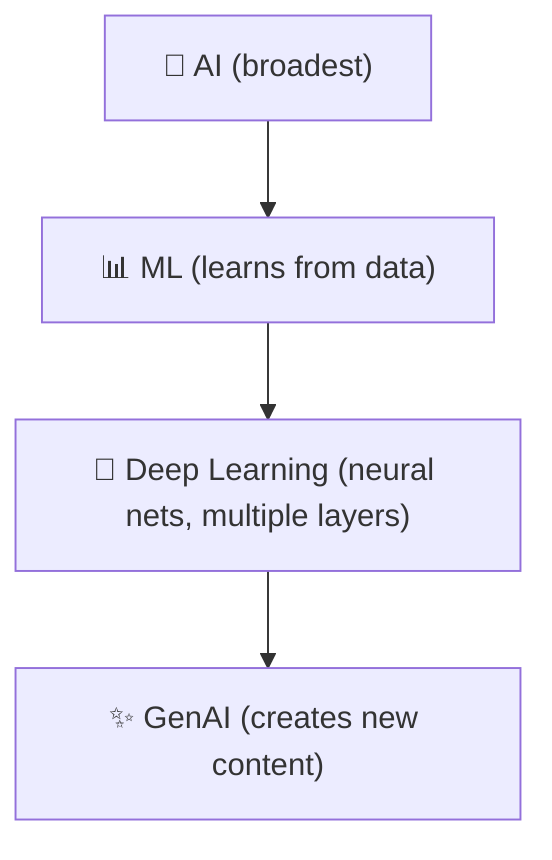

# Day 1 — Domain 1: Fundamentals of AI and ML

> **Exam:** AWS Certified AI Practitioner (AIF-C01)  
> **Date:** April xx, 2026  
> **Goal:** Cover Tasks 1.1, 1.2, 1.3 in one session

---

## Task 1.1 — Basic AI Concepts & Terminology

### Core Definitions

| Term | One-Liner |
|------|-----------|
| **AI** | Machines performing tasks that normally require human intelligence |
| **ML** | Subset of AI — systems learn from data without explicit programming |
| **Deep Learning** | Subset of ML — uses multi-layer neural networks for complex patterns |
| **GenAI** | AI that creates new content (text, images, code) from learned patterns |
| **Neural Network** | Layers of interconnected nodes (input → hidden → output) inspired by the brain |
| **LLM** | Large Language Model — massive neural net trained on text data (e.g., GPT, Claude) |
| **NLP** | Natural Language Processing — machines understanding/generating human language |
| **Computer Vision** | Machines interpreting visual data (images, video) |
| **Model** | The trained artifact that makes predictions |
| **Algorithm** | The method/math used to train the model |
| **Training** | Feeding data to an algorithm to produce a model |
| **Inferencing** | Using a trained model to make predictions on new data |
| **Bias** | Systematic error from skewed data or assumptions |
| **Fairness** | Ensuring model outputs don't discriminate across groups |
| **Fit** | How well a model matches data — underfit (too simple), overfit (too complex), good fit (just right) |

### The AI Hierarchy

**Exam trap:** GenAI is a subset of Deep Learning, not a separate branch.

### Inferencing Types

| Type | When | Latency | Example |
|------|------|---------|---------|
| **Real-time** | Immediate response needed | Low (ms) | Chatbot, fraud detection |
| **Batch** | Process large volumes on schedule | High (min/hrs) | Nightly report generation |

### Data Types

| Category | Types | Notes |
|----------|-------|-------|
| **By label** | Labeled vs Unlabeled | Labeled → supervised; Unlabeled → unsupervised |
| **By structure** | Structured (tables) vs Unstructured (images, text) | Semi-structured = JSON, XML |
| **By format** | Tabular, Time-series, Image, Text | Time-series = data with timestamps |

### Learning Paradigms

| Paradigm | Data | Goal | Example |
|----------|------|------|---------|
| **Supervised** | Labeled | Predict known outcomes | Spam filter, price prediction |
| **Unsupervised** | Unlabeled | Find hidden patterns | Customer segmentation, anomaly detection |
| **Reinforcement** | Reward signals | Maximize cumulative reward | Game AI, robotics |

---
## Task 1.2 — Practical Use Cases for AI

### AWS AI Services Quick Map

| Service | What It Does |
|---------|-------------|
| **Rekognition** | Image & video analysis |
| **Comprehend** | NLP — sentiment, entities, key phrases |
| **Lex** | Conversational chatbots |
| **Polly** | Text-to-speech |
| **Translate** | Real-time language translation |
| **Transcribe** | Speech-to-text |
| **Textract** | Extract text from scanned docs |
| **Personalize** | Recommendations |
| **Forecast** | Time-series forecasting |
| **Fraud Detector** | Identify fraudulent activity |
| **Kendra** | Intelligent enterprise search |
| **Bedrock** | Managed access to foundation models |
| **SageMaker** | Full ML platform — build, train, deploy |

### When NOT to Use AI

- Simple rule-based logic suffices
- Not enough quality data
- Full human accountability required
- Cost of wrong prediction is catastrophic
## Task 1.3 — ML Development Lifecycle

### The Pipeline

Define Problem → Collect Data → Feature Eng → Train → Evaluate → Deploy & Monitor

| Phase | AWS Tool |
|-------|----------|
| **Collect & Prepare** | S3, Glue, Lake Formation |
| **Feature Engineering** | SageMaker Data Wrangler, Feature Store |
| **Train** | SageMaker Training Jobs |
| **Evaluate** | SageMaker Experiments |
| **Deploy & Monitor** | SageMaker Endpoints, Model Monitor |

### Key Metrics

| Metric | Use When |
|--------|----------|
| **Accuracy** | Balanced classes |
| **Precision** | False positives are costly |
| **Recall** | False negatives are costly |
| **F1 Score** | Imbalanced classes |
| **AUC-ROC** | Comparing models |
| **RMSE** | Regression problems |

### Exam Traps

- **Data split:** Train 70-80% / Validation 10-15% / Test 10-15%
- **Overfitting:** High train accuracy, low test → regularization, more data, dropout
- **Underfitting:** Bad everywhere → model too simple
- **Model drift:** Performance degrades over time → SageMaker Model Monitor

---

## Quick Self-Test

1. What's the difference between AI and ML?
2. Name a use case for unsupervised learning.
3. Batch vs real-time inference — when each?
4. What metric when false negatives are costly?
5. Which AWS service does text-to-speech?
6. What is model drift?
7. Overfit model — symptoms and fixes?

Answers

1. AI = broad field; ML = subset where machines learn from data
2. Customer segmentation, anomaly detection
3. Batch = scheduled bulk jobs; Real-time = instant (chatbots, fraud)
4. Recall
5. Amazon Polly
6. Performance degrades as production data diverges from training data
7. High training accuracy, low test accuracy → more data, regularization, dropout

---

*Exam: April 20, 2026 · Study repo by Rabindra*

---

